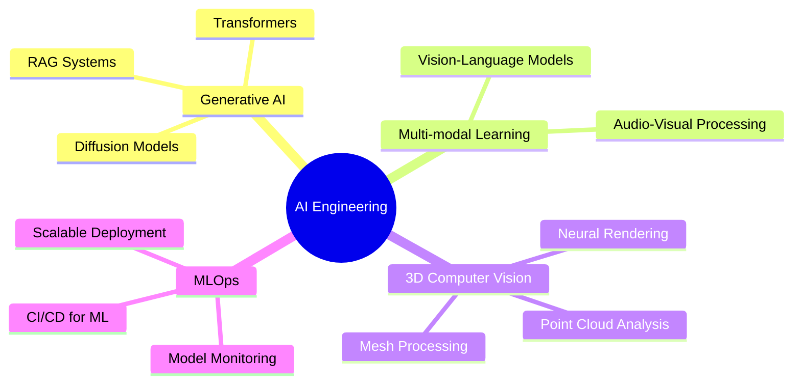

#  Hi there! I'm Abdellah Ennajari

  

  
  
  
  
  
  

  
  

---

  <h2>🎓 Artificial Intelligence Engineering Student | ENIAD Berkane</h2>
  
<i>Building smarter solutions for a smarter world.</i>

I'm **Abdellah Ennajari**, a passionate and motivated **AI engineering student** in my second year at **ENIAD (École Nationale d'Intelligence Artificielle et de Digital)** in Berkane, Morocco. I specialize in **Machine Learning**, **Deep Learning**, and **Computer Vision** with extensive experience in developing innovative AI solutions.

## 🚀 About Me

- 🧠 Currently diving deep into **NLP**, **3D object recognition**, and **interactive product visualization**
- 🛠️ Enjoy building scalable, intelligent systems with **Python**, **TensorFlow**, **Keras**, and **PyTorch**
- 🔭 Actively contributing to **open-source AI projects** and involved in **student leadership** at ENIAD
- 🥇 Finalist in the **National AI Hackathon 2023**
- 🧑‍💼 Experienced with both in-person and remote AI internships with real deliverables
- 📚 Lifelong learner constantly exploring new technologies and methodologies
- 🌍 Passionate about applying AI to solve real-world problems

<h2>🧪 Featured Projects</h2>

### 🦷 3D Dental Classification System (Internship – 3D Smart Factory)
- Developed a high-accuracy 3D dental classification pipeline using **ConvNets**
- Achieved **97% accuracy** on mesh-based dental data
- Preprocessing of 3D meshes, collaboration with dentists, and deployment-ready model
- **Tech stack**: PyTorch, Open3D, NumPy, Docker

### 🌀 360° Product Viewer (Internship – HGS-Hightech)
- Built an interactive product visualization system using **deep learning** and **WebGL**
- Increased product detail accuracy by **40%** through intelligent rendering
- Developed front-end using **HTML5**, **CSS**, and **JavaScript**
- **Tech stack**: Three.js, TensorFlow.js, React, Node.js

### 📝 Sentiment Analysis System (Academic Project)
- Built a pipeline to classify client reviews using **BERT**, **RoBERTa**, and custom NLP models
- Achieved **92% accuracy** on the test set
- **Tech stack**: Hugging Face Transformers, PyTorch, Flask, Docker

### 🌸 Real-Time Flower Recognition App (Personal Project)
- Designed a **CNN-based web app** for classifying flowers using **Streamlit**
- Used advanced data augmentation and achieved **89% accuracy**
- **Tech stack**: TensorFlow, Streamlit, OpenCV, Heroku

### 🤖 Reinforcement Learning for Game AI (Research Project)
- Implemented Deep Q-Learning algorithms for game strategy optimization
- Created custom environments and reward systems
- **Tech stack**: PyTorch, Stable Baselines3, OpenAI Gym

### 📊 MLOps Pipeline for Model Deployment (Team Project)
- Designed end-to-end pipeline for model training, evaluation, and deployment
- Implemented CI/CD practices for ML workflows
- **Tech stack**: MLflow, DVC, GitHub Actions, FastAPI, Kubernetes

<h2>💡 Skills & Technologies</h2>

### Programming Languages

### AI/ML Frameworks

### Computer Vision & NLP

### MLOps & Deployment

### Data Science & Visualization

### Web Development

### 3D & Graphics

### Tools & Environments

## 📈 GitHub Analytics

  
  

  

  

## 📚 Recent Blog Posts

<!-- BLOG-POST-LIST:START -->
- [Optimizing 3D Object Recognition for Dental Applications](https://medium.com/@abdellahennajari/optimizing-3d-object-recognition-for-dental-applications)
- [Deploying AI Models to Production: Lessons Learned](https://medium.com/@abdellahennajari/deploying-ai-models-to-production-lessons-learned)
- [Transfer Learning in Computer Vision: A Practical Guide](https://medium.com/@abdellahennajari/transfer-learning-in-computer-vision)
<!-- BLOG-POST-LIST:END -->

➡️ [More blog posts...](https://medium.com/@abdellahennajari)

## 🎯 Current Focus

```mermaid
mindmap
  root((AI Engineering))
    Generative AI
      Diffusion Models
      Transformers
      RAG Systems
    Multi-modal Learning
      Vision-Language Models
      Audio-Visual Processing
    3D Computer Vision
      Neural Rendering
      Point Cloud Analysis
      Mesh Processing
    MLOps
      CI/CD for ML
      Model Monitoring
      Scalable Deployment
```

## 📜 Certifications

- ✅ TensorFlow Developer Certificate – *Google (2024)*
- ✅ Deep Learning Specialization – *Coursera (2024)*
- ✅ Machine Learning – *365 Data Science (2024)*
- ✅ Web Development – *YouCode Maroc (2023)*
- ✅ Data Analysis – *Udemy (2023)*
- ✅ AWS Machine Learning Specialty – *Amazon (2024)*
- ✅ MLOps Engineering – *DataCamp (2024)*

## 🌐 Languages & Soft Skills

- 🇲🇦 Arabic – Native
- 🇫🇷 French – Professional (B2)
- 🇬🇧 English – Intermediate (B1)
- 🇪🇸 Spanish – Basic (A2)
- 🤝 Leadership & Team Management
- 📊 Project Planning & Agile Methodologies
- 🎤 Public Speaking & Technical Presentations
- 🧠 Critical Thinking & Problem Solving

## 📫 Connect With Me

  
  
  
  
  
  

  
📍 Berkane, Morocco | 📞 +212 6 5579-8315

---

  <h3>🌟 Let's Collaborate!</h3>
  
I'm always open to internships, collaborations, or cool AI/product ideas. If you want to build something impactful—especially in <b>AI</b>, <b>Computer Vision</b>, or <b>3D tech</b>—let's connect!

  
  
  
  
⭐ <i>"Building smarter solutions for a smarter world."</i> ⭐

<!-- GitHub Activity Graph -->

