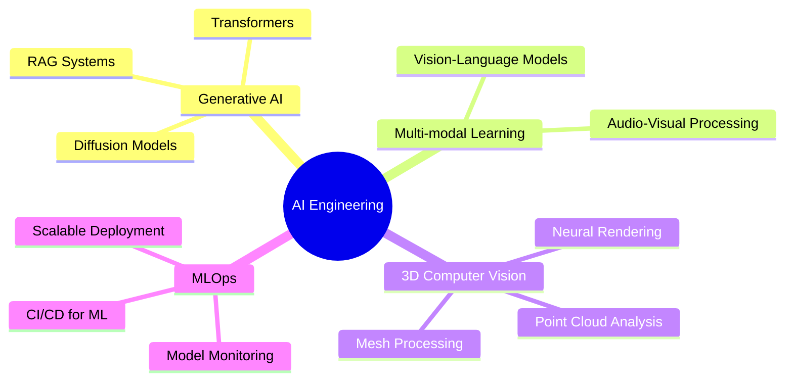
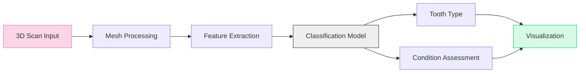
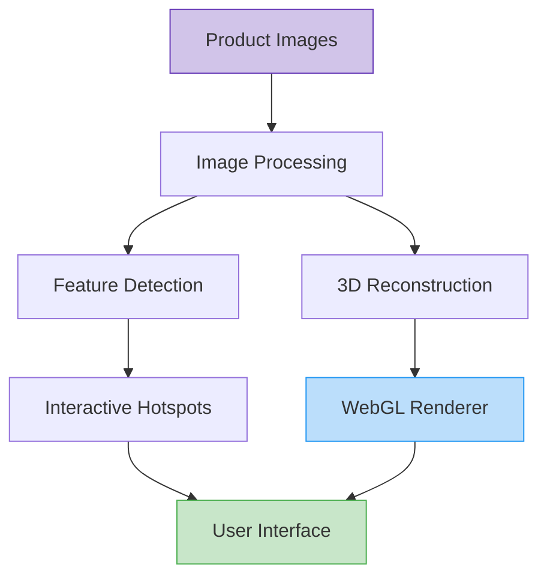
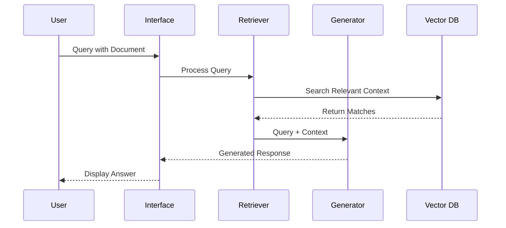

 **Hi there! I'm Abdellah Ennajari**

<div align="center">
  

  <!-- Typing Animation -->
  <a href="https://git.io/typing-svg">
    
  </a>
  
  [](https://github.com/ennajari)
  [](https://www.linkedin.com/in/ennajari-abdellah)
  [](https://ennajari.github.io)
  [](mailto:abdellahennajari2018@gmail.com)
</div>

<p align="center">
  <a href="#about-me">About Me</a> •
  <a href="#current-focus">Current Focus</a> •
  <a href="#projects">Projects</a> •
  <a href="#skills">Skills</a> •
  <a href="#stats">Stats</a> •
  <a href="#blog">Blog</a> •
  <a href="#connect">Connect</a>
</p>

---

## 🎓 Artificial Intelligence Engineering Student | ENIAD Berkane
I'm **Abdellah Ennajari**, an enthusiastic **AI Engineering student** currently in my second year at **ENIAD** (École Nationale d'Intelligence Artificielle et de Digital) in Berkane, Morocco. I specialize in **Machine Learning, Deep Learning, and Computer Vision**, with a passion for **Generative AI, Natural Language Processing (NLP), and Large Language Models (LLMs)**.

<div align="center">
  
  
</div>

---

<a id="about-me"></a>
## 🚀 About Me

<div align="center">
  
</div>

```python
class AbdellahEnnajari:
    def __init__(self):
        self.name = "Abdellah Ennajari"
        self.role = "AI Engineering Student"
        self.education = "ENIAD (École Nationale d'Intelligence Artificielle et de Digital), Berkane"
        self.location = "Morocco"
        self.languages = ["Python", "TensorFlow", "PyTorch", "OpenCV", "Keras", "NumPy", "Pandas"]
        self.research_interests = ["Machine Learning", "Deep Learning", "Computer Vision", 
                                  "Natural Language Processing", "Generative AI", "3D Vision", 
                                  "Responsible AI", "MLOps"]
        self.hobbies = ["Competitive Programming", "Open-Source Contribution", 
                       "AI Research", "Hiking"]
    
    def say_hi(self):
        print(f"Hello, I'm {self.name}. Thanks for dropping by! Let's build something innovative!")

# Instantiate the class and call the method
me = AbdellahEnnajari()
me.say_hi()
```

- 🧠 Currently diving deep into **LLMs**, **Generative AI**, **3D object recognition**, and **Multi-agent systems**
- 🛠️ I enjoy building intelligent systems with **Python**, **TensorFlow**, **PyTorch**, **scikit-learn**, and **Hugging Face**
- 📚 Researching applications of **diffusion models** and **transformers** in medical imaging
- 🔭 Actively contributing to **open-source AI projects** and involved in **student leadership** at ENIAD
- 🥇 Finalist in the **National AI Hackathon 2023** and **2nd place** in Google Developer Groups AI Challenge 2024
- 🌱 Currently learning **AWS** and **Docker** for ML deployment

<div align="center">
  <a href="#"></a>
  <a href="#"></a>
  <a href="#"></a>
</div>

---

<a id="current-focus"></a>
## 🔍 Current Focus

<div align="center">
  
</div>


```mermaid
mindmap
  root((AI Engineering))
    Generative AI
      Diffusion Models
      Transformers
      RAG Systems
    Multi-modal Learning
      Vision-Language Models
      Audio-Visual Processing
    3D Computer Vision
      Neural Rendering
      Point Cloud Analysis
      Mesh Processing
    MLOps
      CI/CD for ML
      Model Monitoring
      Scalable Deployment
```

<div align="center">
  <h3>AI Development Journey</h3>
  
</div>

<div align="center">
  <blockquote>
    <p><i>"The best thing software can be is easy, but the way to do this is to get the defaults right, not to limit users' choices."</i></p>
    <footer>- Paul Graham</footer>
  </blockquote>
</div>

---

<a id="projects"></a>
## 🧪 Projects

<div align="center">
  
</div>

<details>
<summary><b>🦷 3D Dental Classification System (Internship – 3D Smart Factory)</b></summary>
<br>


<div align="center">
  
</div>

- Developed a high-accuracy 3D dental classification pipeline using **ConvNets** and **PointNet++**
- Achieved **97% accuracy** on mesh-based dental data with **35% faster inference** than previous solutions
- Created custom data augmentation techniques for 3D meshes, collaborated with dentists
- Implemented visualization tools for explainable AI to help dentists understand model decisions
- **Tech stack:** PyTorch3D, NumPy, Matplotlib, Plotly, Open3D, Flask


```mermaid
graph LR
    A[3D Scan Input] --> B[Mesh Processing]
    B --> C[Feature Extraction]
    C --> D[Classification Model]
    D --> E[Tooth Type]
    D --> F[Condition Assessment]
    E --> G[Visualization]
    F --> G
    
    style A fill:#f9d5e5,stroke:#ff69b4
    style D fill:#eeeeee,stroke:#333333
    style G fill:#d5f9e5,stroke:#00cc66
```
</details>

<details>
<summary><b>🌀 360° Product Viewer (Internship – HGS-Hightech)</b></summary>
<br>


<div align="center">
  
</div>

- Built an interactive product visualization system using **deep learning** and **WebGL**
- Increased product detail accuracy by **40%** through intelligent rendering
- Implemented automatic hotspot detection for key product features using custom **object detection**
- Developed responsive front-end using **HTML5**, **CSS**, **JavaScript** with **Three.js**
- **Tech stack:** TensorFlow, Three.js, WebGL, Node.js, MongoDB


```mermaid
graph TD
    A[Product Images] --> B[Image Processing]
    B --> C[Feature Detection]
    B --> D[3D Reconstruction]
    C --> E[Interactive Hotspots]
    D --> F[WebGL Renderer]
    E --> G[User Interface]
    F --> G
    
    style A fill:#d1c4e9,stroke:#673ab7
    style F fill:#bbdefb,stroke:#2196f3
    style G fill:#c8e6c9,stroke:#4caf50
```
</details>

<details>
<summary><b>🤖 Multi-modal Chatbot for Students (Team Project)</b></summary>
<br>


<div align="center">
  
</div>

- Developing an AI assistant that can answer student questions about course materials
- Implemented **RAG (Retrieval Augmented Generation)** with **Langchain** for accurate responses
- Created custom vector database of curriculum materials with **FAISS**
- Built multi-modal interface that can process text, images, and PDFs
- **Tech stack:** Hugging Face Transformers, Langchain, FAISS, FastAPI, Streamlit, Docker


```mermaid
sequenceDiagram
    participant U as User
    participant I as Interface
    participant R as Retriever
    participant G as Generator
    participant V as Vector DB
    
    U->>I: Query with Document
    I->>R: Process Query
    R->>V: Search Relevant Context
    V-->>R: Return Matches
    R->>G: Query + Context
    G-->>I: Generated Response
    I-->>U: Display Answer
```
</details>

<a href="https://github.com/ennajari?tab=repositories" target="_blank">
  
</a>

---

<a id="skills"></a>
## 💡 Skills & Technologies

<div align="center">
  
</div>

### Programming Languages
<div>
  
  
  
  
  
  
  
</div>

### AI/ML Frameworks
<div>
  
  
  
  
  
  
</div>

### Computer Vision & NLP
<div>
  
  
  
  
  
</div>

### MLOps & Cloud
<div>
  
  
  
  
  
</div>

<div align="center">
  
</div>

---

<a id="stats"></a>
## 📈 GitHub Analytics

<div align="center">
  
  
</div>

<div align="center">
  
</div>

<div align="center">
  
</div>

<div align="center">
  
</div>

---

<a id="blog"></a>
## 📚 Latest Blog Posts

<div align="center">
  <table>
    <tr>
      <td width="33%" align="center">
        <a href="https://medium.com/@ennajari">
          
          <br>
          <strong>Building Explainable Computer Vision Systems for Healthcare</strong>
        </a>
      </td>
      <td width="33%" align="center">
        <a href="https://medium.com/@ennajari">
          
          <br>
          <strong>Diffusion Models: A Practical Implementation Guide</strong>
        </a>
      </td>
      <td width="33%" align="center">
        <a href="https://medium.com/@ennajari">
          
          <br>
          <strong>Advanced Data Augmentation Techniques for 3D Vision</strong>
        </a>
      </td>
    </tr>
  </table>
</div>

➡️ [more blog posts...](https://medium.com/@ennajari)

---

<a id="certifications"></a>
## 📜 Certifications

<div align="center">
  
  
  <div style="display: flex; flex-wrap: wrap; justify-content: center; gap: 10px;">
    <a href="#"></a>
    <a href="#"></a>
    <a href="#"></a>
    <a href="#"></a>
    <a href="#"></a>
  </div>
</div>

---

<a id="connect"></a>
## 🔗 Connect With Me

<div align="center">
  <a href="https://www.linkedin.com/in/ennajari-abdellah"></a>
  <a href="https://github.com/ennajari"></a>
  <a href="mailto:abdellahennajari2018@gmail.com"></a>
  <a href="https://ennajari.github.io"></a>
  <a href="https://medium.com/@ennajari"></a>
</div>

<div align="center">
  
</div>
