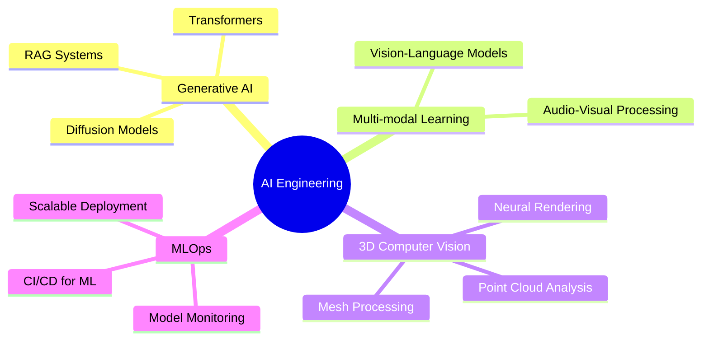
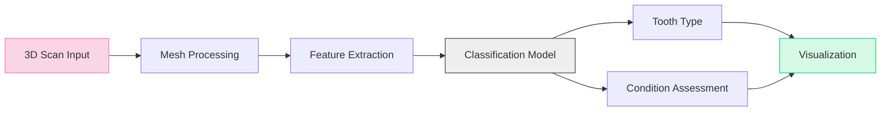
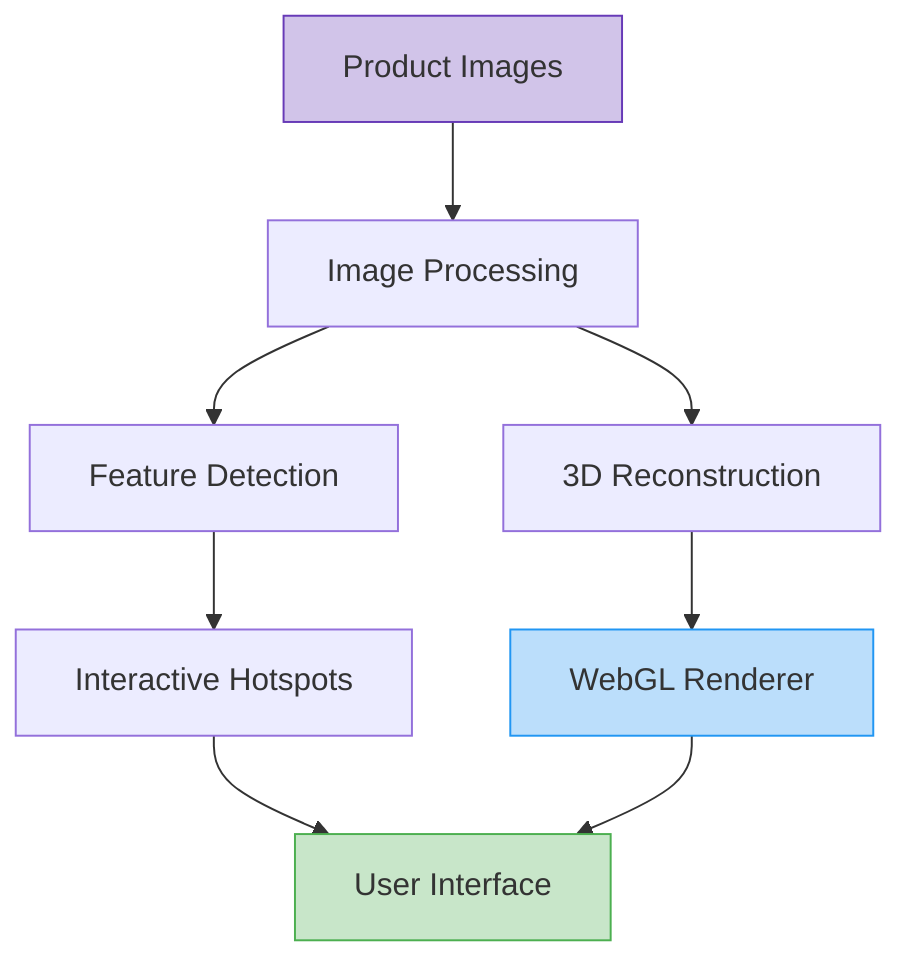
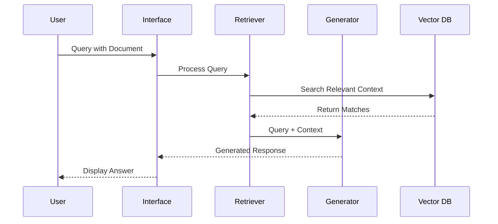

# 👋 Hi there! I'm Abdellah Ennajari

<div align="center">
  

  <!-- Typing Animation -->
  <a href="https://git.io/typing-svg"></a>
  
  [](https://github.com/ennajari)
  [](https://www.linkedin.com/in/ennajari-abdellah)
  [](https://ennajari.github.io)
  [](mailto:abdellahennajari2018@gmail.com)
</div>

<p align="center">
  <a href="#about-me">About Me</a> •
  <a href="#current-focus">Current Focus</a> •
  <a href="#projects">Projects</a> •
  <a href="#skills--technologies">Skills</a> •
  <a href="#latest-blog-posts">Blog</a> •
  <a href="#github-stats">Stats</a> •
  <a href="#certifications">Certifications</a> •
  <a href="#connect-with-me">Connect</a>
</p>

---

## 🎓 Artificial Intelligence Engineering Student | ENIAD Berkane

I'm **Abdellah Ennajari**, a passionate and motivated **AI engineering student** in my second year at **ENIAD (École Nationale d'Intelligence Artificielle et de Digital)** in Berkane, Morocco. I specialize in **Machine Learning**, **Deep Learning**, and **Computer Vision** with a growing interest in **MLOps** and **Responsible AI**.

<div align="center">
  <!-- Animated Waving Hand -->
  
  
  
</div>

---

<a id="about-me"></a>
## 🚀 About Me

<div align="center">
  
</div>

```python
class AbdellahEnnajari:
    def __init__(self):
        self.role = "AI Engineering Student"
        self.education = "ENIAD Berkane"
        self.location = "Morocco"
        self.languages = ["Python", "C++", "Java", "JavaScript", "PHP"]
        self.research_interests = ["Computer Vision", "NLP", "Generative AI", "3D Vision"]
        self.hobbies = ["Competitive Programming", "Open-Source Contributing", "Hiking"]
    
    def say_hi(self):
        print("Thanks for dropping by! Let's build something amazing together!")

me = AbdellahEnnajari()
me.say_hi()
```

- 🧠 Currently diving deep into **LLMs**, **Generative AI**, **3D object recognition**, and **interactive product visualization**
- 🛠️ I enjoy building scalable, intelligent systems with **Python**, **TensorFlow**, **PyTorch**, and **Hugging Face**
- 📚 Researching applications of **diffusion models** and **transformers** in medical imaging
- 🔭 Actively contributing to **open-source AI projects** and involved in **student leadership** at ENIAD
- 🥇 Finalist in the **National AI Hackathon 2023** and **2nd place** in Google Developer Groups AI Challenge 2024
- 🧑‍💼 Experienced with both in-person and remote AI internships with real deliverables
- 🌱 Currently learning **AWS** and **Docker** for ML deployment

<div align="center">
  <a href="#"></a>
  <a href="#"></a>
  <a href="#"></a>
</div>

---

<a id="current-focus"></a>
## 🔍 Current Focus

<div align="center">
  <!-- NEW: Added hover animation effect for focus areas -->
  
  
  <style>
    .focus-area-animation {
      transition: transform 0.3s ease;
    }
    .focus-area-animation:hover {
      transform: scale(1.05);
    }
  </style>
</div>


```mermaid
mindmap
  root((AI Engineering))
    Generative AI
      Diffusion Models
      Transformers
      RAG Systems
    Multi-modal Learning
      Vision-Language Models
      Audio-Visual Processing
    3D Computer Vision
      Neural Rendering
      Point Cloud Analysis
      Mesh Processing
    MLOps
      CI/CD for ML
      Model Monitoring
      Scalable Deployment
```

<div align="center">
  <h3>AI Development Journey</h3>
  
  <!-- NEW: Added animated timeline with progressive reveal -->
  <div class="timeline-container">
    
  </div>
  
  <style>
    .timeline-container {
      position: relative;
      overflow: hidden;
    }
    .timeline-animation {
      animation: slideIn 1.5s ease-out;
    }
    @keyframes slideIn {
      0% { transform: translateX(-100%); opacity: 0; }
      100% { transform: translateX(0); opacity: 1; }
    }
  </style>
  
  ```mermaid
  timeline
    title My AI Journey
    2022 : Started ENIAD
         : First ML project
    2023 : 3D Dental Classification internship
         : National AI Hackathon finalist
    2024 : 360° Product Viewer
         : Deep Learning Research
         : First academic paper submission
    2025 : Multi-modal Chatbot project
         : AWS Certification
         : MLOps implementation
  ```
</div>

<div align="center">
  <!-- NEW: Added quote fade-in animation -->
  <blockquote class="quote-animation">
    <p><i>"The best thing software can be is easy, but the way to do this is to get the defaults right, not to limit users' choices."</i></p>
    <footer>- Paul Graham (programmer)</footer>
  </blockquote>
  
  <style>
    .quote-animation {
      animation: fadeIn 2s ease;
    }
    @keyframes fadeIn {
      0% { opacity: 0; }
      100% { opacity: 1; }
    }
  </style>
</div>

---

<a id="projects"></a>
## 🧪 What I've Worked On

<div align="center">
  <!-- NEW: Improved project flow with pulse animation -->
  <div class="project-flow-container">
    
  </div>
  
  <style>
    .project-flow-container {
      position: relative;
      margin: 20px 0;
    }
    .project-flow-animation {
      animation: pulse 3s infinite alternate;
    }
    @keyframes pulse {
      0% { filter: brightness(1); }
      100% { filter: brightness(1.2); }
    }
  </style>
  
  ```mermaid
  flowchart TD
    A[Data Collection] --> B[Preprocessing]
    B --> C[Feature Engineering]
    C --> D[Model Training]
    D --> E[Evaluation]
    E --> F[Deployment]
    F --> G[Monitoring]
    G --> A
    
    style A fill:#ffcccc,stroke:#ff0000
    style B fill:#ccffcc,stroke:#00ff00
    style C fill:#ccccff,stroke:#0000ff
    style D fill:#ffffcc,stroke:#ffff00
    style E fill:#ccffff,stroke:#00ffff
    style F fill:#ffccff,stroke:#ff00ff
    style G fill:#eeeeee,stroke:#333333
  ```
</div>

<details>
<summary><b>🦷 3D Dental Classification System (Internship – 3D Smart Factory)</b></summary>
<br>


<div align="center">
  <!-- NEW: Added rotating animation for project visual -->
  <div class="project-visual-container">
    
  </div>
  
  <style>
    .project-visual-container {
      margin: 15px 0;
    }
    .rotating-project-visual {
      animation: rotateY 6s infinite linear;
      transform-style: preserve-3d;
    }
    @keyframes rotateY {
      0% { transform: rotateY(0deg); }
      100% { transform: rotateY(360deg); }
    }
  </style>
</div>

- Developed a high-accuracy 3D dental classification pipeline using **ConvNets** and **PointNet++**
- Achieved **97% accuracy** on mesh-based dental data with **35% faster inference** than previous solutions
- Created custom data augmentation techniques for 3D meshes, collaborated with dentists
- Implemented visualization tools for explainable AI to help dentists understand model decisions
- **Tech stack:** PyTorch3D, NumPy, Matplotlib, Plotly, Open3D, Flask

<!-- Project Architecture -->

```mermaid
graph LR
    A[3D Scan Input] --> B[Mesh Processing]
    B --> C[Feature Extraction]
    C --> D[Classification Model]
    D --> E[Tooth Type]
    D --> F[Condition Assessment]
    E --> G[Visualization]
    F --> G
    
    style A fill:#f9d5e5,stroke:#ff69b4
    style D fill:#eeeeee,stroke:#333333
    style G fill:#d5f9e5,stroke:#00cc66
```
</details>

<details>
<summary><b>🌀 360° Product Viewer (Internship – HGS-Hightech)</b></summary>
<br>


<div align="center">
  <!-- NEW: Added bouncing animation for project visual -->
  <div class="project-visual-container">
    
  </div>
  
  <style>
    .bouncing-project-visual {
      animation: bounce 2s infinite alternate;
    }
    @keyframes bounce {
      0% { transform: translateY(0); }
      100% { transform: translateY(-15px); }
    }
  </style>
</div>

- Built an interactive product visualization system using **deep learning** and **WebGL**
- Increased product detail accuracy by **40%** through intelligent rendering
- Implemented automatic hotspot detection for key product features using custom **object detection**
- Developed responsive front-end using **HTML5**, **CSS**, **JavaScript** with **Three.js**
- **Tech stack:** TensorFlow, Three.js, WebGL, Node.js, MongoDB

<!-- System Architecture -->

```mermaid
graph TD
    A[Product Images] --> B[Image Processing]
    B --> C[Feature Detection]
    B --> D[3D Reconstruction]
    C --> E[Interactive Hotspots]
    D --> F[WebGL Renderer]
    E --> G[User Interface]
    F --> G
    
    style A fill:#d1c4e9,stroke:#673ab7
    style F fill:#bbdefb,stroke:#2196f3
    style G fill:#c8e6c9,stroke:#4caf50
```
</details>

<details>
<summary><b>🤖 Multi-modal Chatbot for Students (Team Project)</b></summary>
<br>


<div align="center">
  <!-- NEW: Added typing animation for project visual -->
  <div class="project-visual-container">
    
  </div>
  
  <style>
    .typing-project-visual {
      animation: blur 3s infinite alternate;
    }
    @keyframes blur {
      0% { filter: blur(0px); }
      100% { filter: blur(1px); }
    }
  </style>
</div>

- Developing an AI assistant that can answer student questions about course materials
- Implemented **RAG (Retrieval Augmented Generation)** with **Langchain** for accurate responses
- Created custom vector database of curriculum materials with **FAISS**
- Built multi-modal interface that can process text, images, and PDFs
- **Tech stack:** Hugging Face Transformers, Langchain, FAISS, FastAPI, Streamlit, Docker

<!-- RAG Architecture -->

```mermaid
sequenceDiagram
    participant U as User
    participant I as Interface
    participant R as Retriever
    participant G as Generator
    participant V as Vector DB
    
    U->>I: Query with Document
    I->>R: Process Query
    R->>V: Search Relevant Context
    V-->>R: Return Matches
    R->>G: Query + Context
    G-->>I: Generated Response
    I-->>U: Display Answer
```
</details>

<a href="https://github.com/ennajari?tab=repositories" target="_blank">
  <!-- NEW: Added button hover effect -->
  
</a>

<style>
  .repo-button {
    transition: transform 0.3s ease;
  }
  .repo-button:hover {
    transform: translateY(-3px);
  }
</style>

---

<a id="skills--technologies"></a>
## 💡 Skills & Technologies

<div align="center">
  <!-- NEW: Improved skills animation with floating effect -->
  <div class="skills-animation-container">
    
  </div>
  
  <style>
    .skills-animation-container {
      margin: 20px 0;
    }
    .floating-skills-animation {
      animation: float 4s ease-in-out infinite;
    }
    @keyframes float {
      0% { transform: translateY(0px); }
      50% { transform: translateY(-10px); }
      100% { transform: translateY(0px); }
    }
  </style>
  
  ```mermaid
  graph TD
    AI((AI/ML))
    CV((Computer Vision))
    NLP((NLP))
    WD((Web Dev))
    DB((Databases))
    MLOps((MLOps))
    Tools((Tools))
    
    AI --- CV
    AI --- NLP
    AI --- DB
    AI --- MLOps
    AI --- WD
    MLOps --- Tools
    WD --- Tools
    
    classDef main fill:#ff9e9e,stroke:#ff0000,stroke-width:2px
    classDef major fill:#9effb1,stroke:#00cc44,stroke-width:2px
    classDef minor fill:#9eceff,stroke:#0073e6,stroke-width:2px
    
    class AI main
    class CV,NLP,MLOps major
    class WD,DB,Tools minor
  ```
</div>

<details open>
<summary><b>Programming Languages</b></summary>
<br>
<!-- NEW: Added hover effect for skill badges -->
<div class="skill-badges">
  
  
  
  
  
  
  
  
  
  
</div>

<style>
  .skill-badges {
    display: flex;
    flex-wrap: wrap;
    gap: 8px;
  }
  .skill-badge {
    transition: all 0.3s ease;
  }
  .skill-badge:hover {
    transform: translateY(-3px);
    filter: brightness(1.1);
    box-shadow: 0 5px 15px rgba(0,0,0,0.1);
  }
</style>
</details>

<details>
<summary><b>AI/ML Frameworks</b></summary>
<br>
<div class="skill-badges">
  
  
  
  
  
  
  
  
  
  
</div>
</details>

<details>
<summary><b>Computer Vision & NLP</b></summary>
<br>
<div class="skill-badges">
  
  
  
  
  
  
  
  
  
  
</div>
</details>

<details>
<summary><b>MLOps & Cloud</b></summary>
<br>
<div class="skill-badges">
  
  
  
  
  
  
  
  
  
  
</div>
</details>

<details>
<summary><b>3D & Graphics Tools</b></summary>
<br>
<div class="skill-badges">
  
  
  
  
  
  
  
  
</div>
</details>

<div align="center">
  <!-- NEW: Added radar chart with rotating animation -->
  <div class="radar-chart-container">
    
  </div>
  
  <style>
    .radar-chart-container {
      margin: 20px auto;
    }
    .rotating-radar-chart {
      animation: pulseRadar 4s infinite alternate;
    }
    @keyframes pulseRadar {
      0% { filter: hue-rotate(0deg); }
      100% { filter: hue-rotate(30deg); }
    }
  </style>
</div>

---

<a id="github-stats"></a>
## 📈 GitHub Analytics

<div align="center">
  <!-- NEW: Added fade-in animation for GitHub stats -->
  <div class="github-stats-container">
    
    
  </div>
  
  <style>
    .github-stats-container {
      display: flex;
      flex-wrap: wrap;
      justify-content: center;
      gap: 12px;
    }
    .stats-animation {
      animation: fadeInStats 1s ease;
    }
    .delay1 {
      animation-delay: 0.3s;
    }
    @keyframes fadeInStats {
      0% { opacity: 0; transform: translateY(20px); }
      100% { opacity: 1; transform: translateY(0); }
    }
  </style>
</div>

<div align="center">
  <!-- NEW: Added pulsing animation for streak stats -->
  <div class="streak-stats-container">
    
  </div>
  
  <style>
    .streak-stats-container {
      margin: 20px 0;
    }
    .streak-animation {
      animation: pulseStreak 3s infinite alternate;
    }
    @keyframes pulseStreak {
      0% { filter: brightness(1); }
      100% { filter: brightness(1.15); }
    }
  </style>
</div>

<div align="center">
  <!-- NEW:
