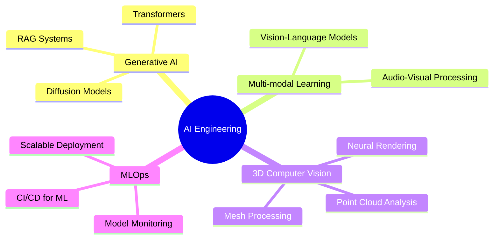
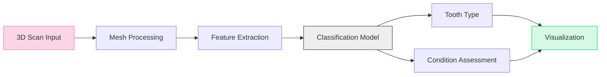
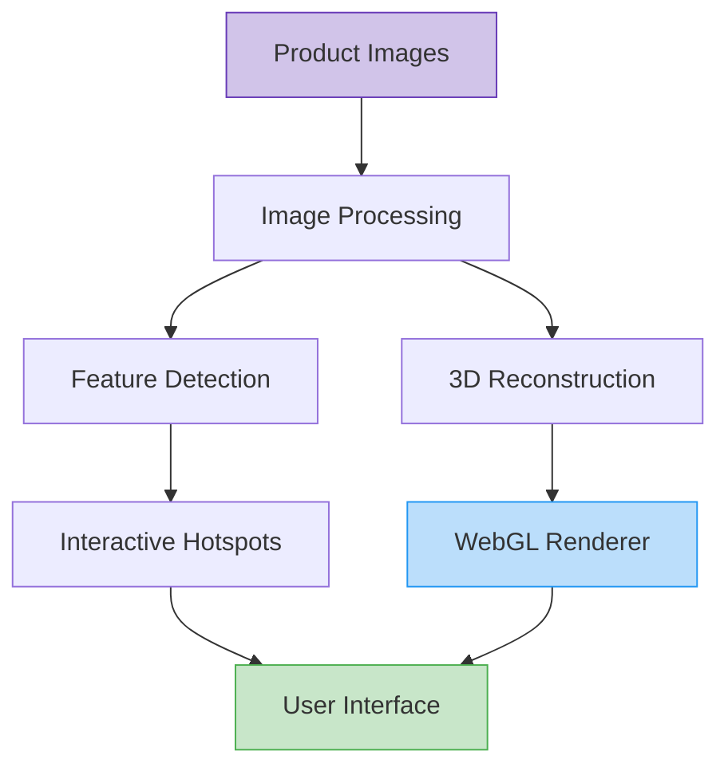
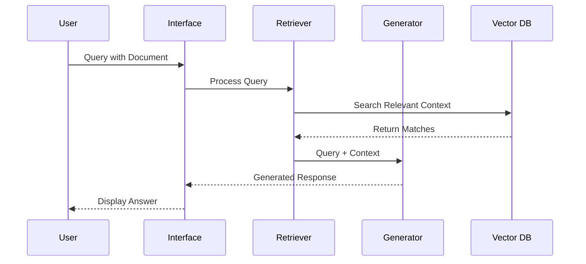
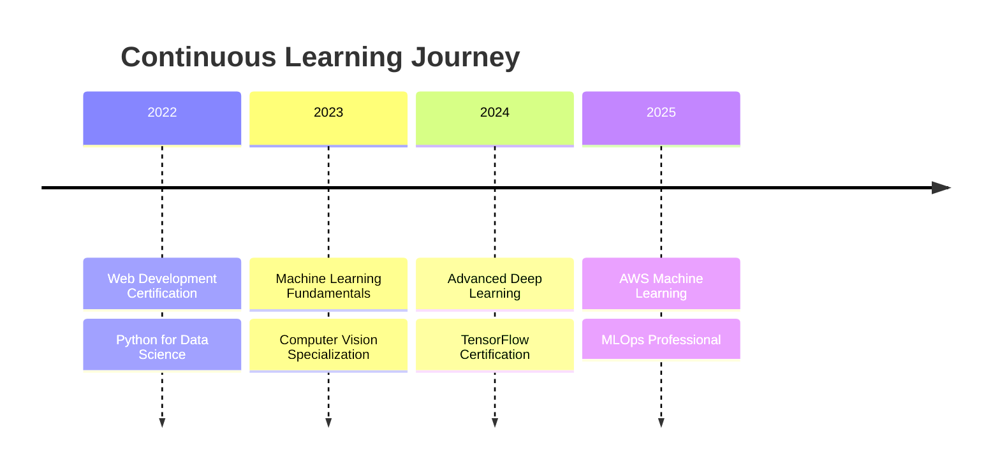
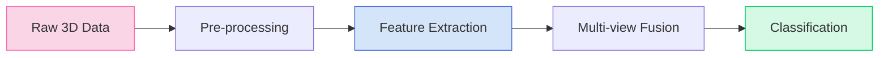
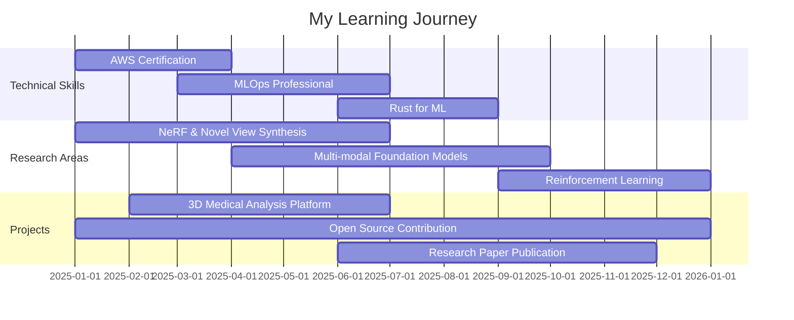

 Hi there! I'm Abdellah Ennajari

<div align="center">
  

  <!-- Typing Animation -->
  <a href="https://git.io/typing-svg"></a>
  
  [](https://github.com/ennajari)
  [](https://www.linkedin.com/in/ennajari-abdellah)
  [](https://ennajari.github.io)
  [](mailto:abdellahennajari2018@gmail.com)
</div>

<p align="center">
  <a href="#about-me">About Me</a> •
  <a href="#current-focus">Current Focus</a> •
  <a href="#projects">Projects</a> •
  <a href="#skills--technologies">Skills</a> •
  <a href="#latest-blog-posts">Blog</a> •
  <a href="#github-stats">Stats</a> •
  <a href="#certifications">Certifications</a> •
  <a href="#connect-with-me">Connect</a>
</p>

---

## 🎓 Artificial Intelligence Engineering Student | ENIAD Berkane

I'm **Abdellah Ennajari**, a passionate and motivated **AI engineering student** in my second year at **ENIAD (École Nationale d'Intelligence Artificielle et de Digital)** in Berkane, Morocco. I specialize in **Machine Learning**, **Deep Learning**, and **Computer Vision** with a growing interest in **MLOps** and **Responsible AI**.

<div align="center">
  <!-- Animated Waving Hand -->
  
  
  
</div>

---

<a id="about-me"></a>
## 🚀 About Me

<div align="center">
  
</div>

```python
class AbdellahEnnajari:
    def __init__(self):
        self.role = "AI Engineering Student"
        self.education = "ENIAD Berkane"
        self.location = "Morocco"
        self.languages = ["Python", "C++", "Java", "JavaScript", "PHP"]
        self.research_interests = ["Computer Vision", "NLP", "Generative AI", "3D Vision"]
        self.hobbies = ["Competitive Programming", "Open-Source Contributing", "Hiking"]
    
    def say_hi(self):
        print("Thanks for dropping by! Let's build something amazing together!")

me = AbdellahEnnajari()
me.say_hi()
```

- 🧠 Currently diving deep into **LLMs**, **Generative AI**, **3D object recognition**, and **interactive product visualization**
- 🛠️ I enjoy building scalable, intelligent systems with **Python**, **TensorFlow**, **PyTorch**, and **Hugging Face**
- 📚 Researching applications of **diffusion models** and **transformers** in medical imaging
- 🔭 Actively contributing to **open-source AI projects** and involved in **student leadership** at ENIAD
- 🥇 Finalist in the **National AI Hackathon 2023** and **2nd place** in Google Developer Groups AI Challenge 2024
- 🧑‍💼 Experienced with both in-person and remote AI internships with real deliverables
- 🌱 Currently learning **AWS** and **Docker** for ML deployment

<div align="center">
  <a href="#"></a>
  <a href="#"></a>
  <a href="#"></a>
</div>

---

<a id="current-focus"></a>
## 🔍 Current Focus

<div align="center">
  <!-- Animated Mindmap for Current Focus - Adding a GIF representation -->
  
</div>


```mermaid
mindmap
  root((AI Engineering))
    Generative AI
      Diffusion Models
      Transformers
      RAG Systems
    Multi-modal Learning
      Vision-Language Models
      Audio-Visual Processing
    3D Computer Vision
      Neural Rendering
      Point Cloud Analysis
      Mesh Processing
    MLOps
      CI/CD for ML
      Model Monitoring
      Scalable Deployment
```

<div align="center">
  <h3>AI Development Journey</h3>
  
  <!-- Development Timeline using custom animation -->
  
  
  ```mermaid
  timeline
    title My AI Journey
    2022 : Started ENIAD
         : First ML project
    2023 : 3D Dental Classification internship
         : National AI Hackathon finalist
    2024 : 360° Product Viewer
         : Deep Learning Research
         : First academic paper submission
    2025 : Multi-modal Chatbot project
         : AWS Certification
         : MLOps implementation
  ```
</div>

<div align="center">
  <blockquote>
    <p><i>"The best thing software can be is easy, but the way to do this is to get the defaults right, not to limit users' choices."</i></p>
    <footer>- Paul Graham (programmer)</footer>
  </blockquote>
</div>

---

<a id="projects"></a>
## 🧪 What I've Worked On

<div align="center">
  <!-- Interactive Project Architecture Diagram -->
  
  
  ```mermaid
  flowchart TD
    A[Data Collection] --> B[Preprocessing]
    B --> C[Feature Engineering]
    C --> D[Model Training]
    D --> E[Evaluation]
    E --> F[Deployment]
    F --> G[Monitoring]
    G --> A
    
    style A fill:#ffcccc,stroke:#ff0000
    style B fill:#ccffcc,stroke:#00ff00
    style C fill:#ccccff,stroke:#0000ff
    style D fill:#ffffcc,stroke:#ffff00
    style E fill:#ccffff,stroke:#00ffff
    style F fill:#ffccff,stroke:#ff00ff
    style G fill:#eeeeee,stroke:#333333
  ```
</div>

<details>
<summary><b>🦷 3D Dental Classification System (Internship – 3D Smart Factory)</b></summary>
<br>


<div align="center">
  
</div>

- Developed a high-accuracy 3D dental classification pipeline using **ConvNets** and **PointNet++**
- Achieved **97% accuracy** on mesh-based dental data with **35% faster inference** than previous solutions
- Created custom data augmentation techniques for 3D meshes, collaborated with dentists
- Implemented visualization tools for explainable AI to help dentists understand model decisions
- **Tech stack:** PyTorch3D, NumPy, Matplotlib, Plotly, Open3D, Flask

<!-- Project Architecture -->

```mermaid
graph LR
    A[3D Scan Input] --> B[Mesh Processing]
    B --> C[Feature Extraction]
    C --> D[Classification Model]
    D --> E[Tooth Type]
    D --> F[Condition Assessment]
    E --> G[Visualization]
    F --> G
    
    style A fill:#f9d5e5,stroke:#ff69b4
    style D fill:#eeeeee,stroke:#333333
    style G fill:#d5f9e5,stroke:#00cc66
```
</details>

<details>
<summary><b>🌀 360° Product Viewer (Internship – HGS-Hightech)</b></summary>
<br>


<div align="center">
  
</div>

- Built an interactive product visualization system using **deep learning** and **WebGL**
- Increased product detail accuracy by **40%** through intelligent rendering
- Implemented automatic hotspot detection for key product features using custom **object detection**
- Developed responsive front-end using **HTML5**, **CSS**, **JavaScript** with **Three.js**
- **Tech stack:** TensorFlow, Three.js, WebGL, Node.js, MongoDB

<!-- System Architecture -->

```mermaid
graph TD
    A[Product Images] --> B[Image Processing]
    B --> C[Feature Detection]
    B --> D[3D Reconstruction]
    C --> E[Interactive Hotspots]
    D --> F[WebGL Renderer]
    E --> G[User Interface]
    F --> G
    
    style A fill:#d1c4e9,stroke:#673ab7
    style F fill:#bbdefb,stroke:#2196f3
    style G fill:#c8e6c9,stroke:#4caf50
```
</details>

<details>
<summary><b>🤖 Multi-modal Chatbot for Students (Team Project)</b></summary>
<br>


<div align="center">
  
</div>

- Developing an AI assistant that can answer student questions about course materials
- Implemented **RAG (Retrieval Augmented Generation)** with **Langchain** for accurate responses
- Created custom vector database of curriculum materials with **FAISS**
- Built multi-modal interface that can process text, images, and PDFs
- **Tech stack:** Hugging Face Transformers, Langchain, FAISS, FastAPI, Streamlit, Docker

<!-- RAG Architecture -->

```mermaid
sequenceDiagram
    participant U as User
    participant I as Interface
    participant R as Retriever
    participant G as Generator
    participant V as Vector DB
    
    U->>I: Query with Document
    I->>R: Process Query
    R->>V: Search Relevant Context
    V-->>R: Return Matches
    R->>G: Query + Context
    G-->>I: Generated Response
    I-->>U: Display Answer
```
</details>

<a href="https://github.com/ennajari?tab=repositories" target="_blank">
  
</a>

---

<a id="skills--technologies"></a>
## 💡 Skills & Technologies

<div align="center">
  <!-- Animated Skills Chart -->
  
  
  ```mermaid
  graph TD
    AI((AI/ML))
    CV((Computer Vision))
    NLP((NLP))
    WD((Web Dev))
    DB((Databases))
    MLOps((MLOps))
    Tools((Tools))
    
    AI --- CV
    AI --- NLP
    AI --- DB
    AI --- MLOps
    AI --- WD
    MLOps --- Tools
    WD --- Tools
    
    classDef main fill:#ff9e9e,stroke:#ff0000,stroke-width:2px
    classDef major fill:#9effb1,stroke:#00cc44,stroke-width:2px
    classDef minor fill:#9eceff,stroke:#0073e6,stroke-width:2px
    
    class AI main
    class CV,NLP,MLOps major
    class WD,DB,Tools minor
  ```
</div>

<details open>
<summary><b>Programming Languages</b></summary>
<br>
<div>
  
  
  
  
  
  
  
  
  
  
</div>
</details>

<details>
<summary><b>AI/ML Frameworks</b></summary>
<br>
<div>
  
  
  
  
  
  
  
  
  
  
</div>
</details>

<details>
<summary><b>Computer Vision & NLP</b></summary>
<br>
<div>
  
  
  
  
  
  
  
  
  
  
</div>
</details>

<details>
<summary><b>MLOps & Cloud</b></summary>
<br>
<div>
  
  
  
  
  
  
  
  
  
  
</div>
</details>

<details>
<summary><b>3D & Graphics Tools</b></summary>
<br>
<div>
  
  
  
  
  
  
  
  
</div>
</details>

<div align="center">
  <!-- Interactive Technology Expertise Radar Chart -->
  
</div>

---

<a id="github-stats"></a>
## 📈 GitHub Analytics

<div align="center">
  <!-- Enhanced GitHub Stats with Animations -->
  
  
</div>

<div align="center">
  <!-- Animated Contribution Streak -->
  
</div>

<div align="center">
  <!-- Enhanced 3D Contribution Chart -->
  
</div>

<div align="center">
  <!-- Animated Trophy Display -->
  
</div>

<div align="center">
  <!-- Activity Graph -->
  
</div>

---

<a id="latest-blog-posts"></a>
## 📚 Latest Blog Posts

<div align="center">
  <a href="https://medium.com/@ennajari"></a>
</div>

<div align="center">
  <!-- Enhanced Blog Post Cards with Animations -->
  <table>
    <tr>
      <td width="33%" align="center">
        <a href="https://medium.com/@ennajari">
          
          <br>
          <strong>Building Explainable Computer Vision Systems for Healthcare</strong>
        </a>
      </td>
      <td width="33%" align="center">
        <a href="https://medium.com/@ennajari">
          
          <br>
          <strong>Diffusion Models: A Practical Implementation Guide</strong>
        </a>
      </td>
      <td width="33%" align="center">
        <a href="https://medium.com/@ennajari">
          
          <br>
          <strong>Advanced Data Augmentation Techniques for 3D Vision</strong>
        </a>
      </td>
    </tr>
  </table>
</div>

➡️ [more blog posts...](https://medium.com/@ennajari)

---

<a id="certifications"></a>
## 📜 Certifications

<div align="center">
  <!-- Enhanced Certification Display with Animation -->
  
  
  <div style="display: flex; flex-wrap: wrap; justify-content: center; gap: 10px;">
    <a href="#"></a>
    <a href="#"></a>
    <a href="#"></a>
    <a href="#"></a>
    <a href="#"></a>
  </div>
</div>

<!-- Certification Timeline -->

```mermaid
timeline
  title Continuous Learning Journey
    2022 : Web Development Certification
         : Python for Data Science
    2023 : Machine Learning Fundamentals
         : Computer Vision Specialization
    2024 : Advanced Deep Learning
         : TensorFlow Certification
    2025 : AWS Machine Learning
         : MLOps Professional
```

---

<a id="connect-with-me"></a>
## 📫 Connect With Me

<div align="center">
  <!-- Animated Connect Section with enhanced visuals -->
  
  
  <a href="https://linkedin.com/in/ennajari-abdellah" target="_blank">
    
  </a>
  <a href="https://github.com/ennajari" target="_blank">
    
  </a>
  <a href="https://medium.com/@ennajari" target="_blank">
    
  </a>
  <a href="mailto:abdellahennajari2018@gmail.com" target="_blank">
    
  </a>
  <a href="https://twitter.com/ennajari_ai" target="_blank">
    
  </a>
</div>

<div align="center">
  <!-- Final animated banner -->
  
  
  <h3>Thanks for visiting my profile! Let's connect and build something amazing together. 🚀</h3>
</div>

<!--
**ennajari/ennajari** is a ✨ _special_ ✨ repository because its `README.md` (this file) appears on your GitHub profile.
---

<a id="achievements"></a>
## 🏆 Achievements & Awards

<div align="center">
  <!-- Animated Awards Section -->
  
</div>

<table>
  <tr>
    <td align="center">
      
      <br>
      <strong>2nd Place in Google Developer Groups AI Challenge</strong>
      <br>
      <em>Built an innovative solution for sustainable development using computer vision</em>
    </td>
    <td align="center">
      
      <br>
      <strong>National AI Hackathon Finalist</strong>
      <br>
      <em>Created an AI-driven healthcare solution for early disease detection</em>
    </td>
  </tr>
  <tr>
    <td align="center">
      
      <br>
      <strong>ENIAD Excellence Scholarship</strong>
      <br>
      <em>Awarded for outstanding academic performance and research contributions</em>
    </td>
    <td align="center">
      
      <br>
      <strong>Best Student Project in AI Innovation</strong>
      <br>
      <em>Recognized for developing a novel approach to computer vision problems</em>
    </td>
  </tr>
</table>

---

<a id="publications"></a>
## 📝 Publications & Research

<div align="center">
  <!-- Research Visualization -->
  
</div>

<details>
<summary><b>🔬 Academic Papers & Preprints</b></summary>
<br>

<div align="center">
  <!-- Publication Cards -->
  <table>
    <tr>
      <td width="50%" align="center">
        <strong>Advancing 3D Dental Classification Through Multi-view Representation Learning</strong>
        <br>
        <em>Submitted to International Conference on Medical Image Computing and Computer Assisted Intervention (MICCAI) 2025</em>
        <br>
        
      </td>
      <td width="50%" align="center">
        <strong>Efficient Point Cloud Processing for Resource-Constrained Environments</strong>
        <br>
        <em>Technical Report, ENIAD Research Lab, 2024</em>
        <br>
        
      </td>
    </tr>
  </table>
</div>


```mermaid
graph LR
    A[Raw 3D Data] --> B[Pre-processing]
    B --> C[Feature Extraction]
    C --> D[Multi-view Fusion]
    D --> E[Classification]
    
    style A fill:#f9d5e5,stroke:#ff69b4
    style C fill:#d5e5f9,stroke:#4169e1
    style E fill:#d5f9e5,stroke:#00cc66
```

</details>

<details>
<summary><b>🧪 Ongoing Research</b></summary>
<br>

<div align="center">
  <h4>Current Research Interests</h4>
  
  <table>
    <tr>
      <td align="center">
        
        <br>
        <strong>Foundation Models for 3D Medical Imaging</strong>
        <br>
        <em>Developing transformer-based architectures for dental and medical 3D data analysis</em>
      </td>
    </tr>
    <tr>
      <td align="center">
        
        <br>
        <strong>Efficient Neural Rendering for Interactive Applications</strong>
        <br>
        <em>Optimizing real-time 3D rendering techniques for product visualization</em>
      </td>
    </tr>
    <tr>
      <td align="center">
        
        <br>
        <strong>Responsible AI: Fairness in Medical Diagnosis Systems</strong>
        <br>
        <em>Investigating bias mitigation strategies in healthcare AI applications</em>
      </td>
    </tr>
  </table>
</div>

</details>

---

<a id="community"></a>
## 👥 Community Involvement & Teaching

<div align="center">
  <!-- Community Animation -->
  
  
  ```mermaid
  mindmap
    root((Community\nEngagement))
      Mentorship
        AI Club Lead at ENIAD
        Python Tutor
        Hackathon Coach
      Open Source
        TensorFlow Contributor
        HuggingFace Documentation
        PyTorch Issues & PRs
      Events
        AI Workshops
        Technical Talks
        Code Sprints
  ```
</div>

<table>
  <tr>
    <td width="50%" align="center">
      <h4>Workshop Materials</h4>
      <a href="https://github.com/ennajari/ai-workshops">
        
      </a>
      <p><em>A collection of tutorials, notebooks, and resources from workshops I've conducted</em></p>
    </td>
    <td width="50%" align="center">
      <h4>Teaching Assistant</h4>
      
      <p><em>Supporting first-year students with practical AI development skills and project guidance</em></p>
    </td>
  </tr>
</table>

---

<a id="roadmap"></a>
## 🗺️ Learning Roadmap (2025-2026)

<div align="center">
  <!-- Learning Roadmap Visualization -->
  
</div>


```mermaid
gantt
    title My Learning Journey
    dateFormat  YYYY-MM
    section Technical Skills
    AWS Certification             :2025-01, 3M
    MLOps Professional            :2025-03, 4M
    Rust for ML                   :2025-06, 3M
    section Research Areas
    NeRF & Novel View Synthesis   :2025-01, 6M
    Multi-modal Foundation Models :2025-04, 6M
    Reinforcement Learning        :2025-09, 4M
    section Projects
    3D Medical Analysis Platform  :2025-02, 5M
    Open Source Contribution      :2025-01, 12M
    Research Paper Publication    :2025-06, 6M
```

<div align="center">
  <blockquote>
    <p><i>"The expert in anything was once a beginner."</i></p>
    <footer>- Helen Hayes</footer>
  </blockquote>
</div>

---

<div align="center">
  <!-- Final Note -->
  
  
  <h3>Feel free to reach out for collaborations, research opportunities, or just to chat about AI! 💡</h3>
  
  
</div>

<!-- This README is continuously evolving as I learn and grow in my AI journey -->
