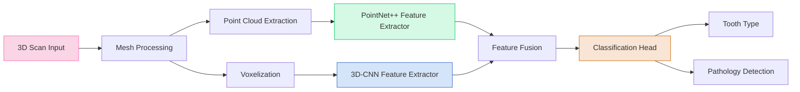
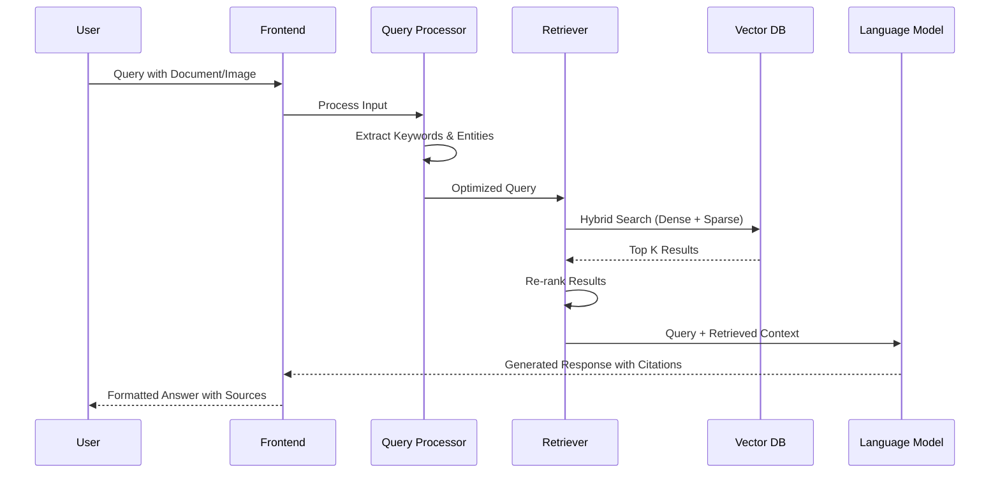
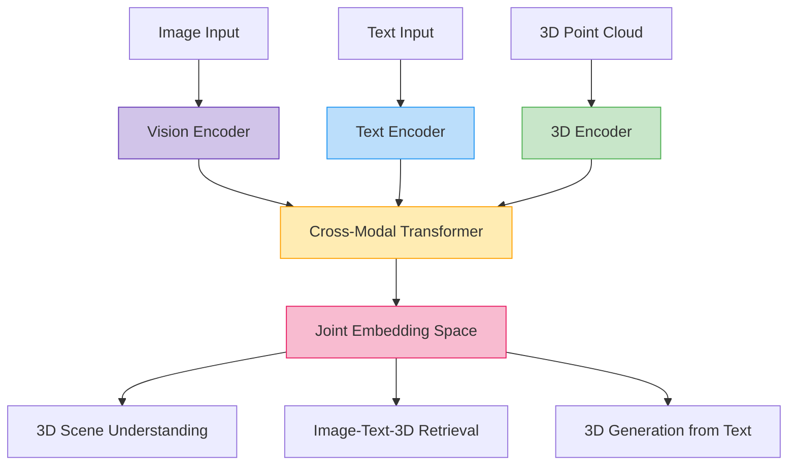

 **Hi there! I'm Abdellah Ennajari**

<div align="center">
  

  <!-- Typing Animation -->
<a href="https://git.io/typing-svg" target="_blank" rel="noopener noreferrer">
  
</a>
  
  [](https://github.com/ennajari)
  [](https://www.linkedin.com/in/ennajari-abdellah)
  [](https://ennajari.github.io/AI_Engineer/)
  [](mailto:abdellahennajari2018@gmail.com)
  [](https://huggingface.co/)
</div>

<p align="center">
  <a href="#about-me">About Me</a> •
  <a href="#ai-specialization">AI Specialization</a> •
  <a href="#ai-projects">AI Projects</a> •
  <a href="#technical-skills">Technical Skills</a> •
  <a href="#ai-research">Research</a> •
  <a href="#github-stats">Stats</a> •
  <a href="#certifications">Certifications</a> •
  <a href="#connect-with-me">Connect</a>
</p>

---

## 🎓 AI & Deep Learning Engineer | ENIAD Berkane
I'm **Abdellah Ennajari**, a dedicated **AI Engineer** currently pursuing my degree at **ENIAD** (École Nationale d'Intelligence Artificielle et de Digital) in Berkane, Morocco. I specialize in developing advanced **Deep Learning models**, **Computer Vision systems**, and **Generative AI applications**. My expertise encompasses the complete AI development lifecycle, from data preprocessing and feature engineering to model deployment and monitoring.


<div align="center">
  <!-- Animated Waving Hand -->
  
  
  
</div>

---

<a id="about-me"></a>
## 🚀 About Me

```python
class AbdellahEnnajari:
    def __init__(self):
        self.name = "Abdellah Ennajari"
        self.role = "AI & Deep Learning Engineer"
        self.education = "ENIAD (École Nationale d'Intelligence Artificielle et de Digital), Berkane"
        self.location = "Morocco"
        self.tech_stack = {
            "deep_learning": ["TensorFlow", "PyTorch", "JAX", "Keras"],
            "computer_vision": ["OpenCV", "PyTorch3D", "Detectron2", "MediaPipe", "Kornia"],
            "nlp": ["Transformers", "Langchain", "SpaCy", "NLTK", "HuggingFace"],
            "generative_ai": ["Diffusion Models", "GANs", "Stable Diffusion", "RAG"],
            "mlops": ["Docker", "Kubernetes", "MLflow", "DVC", "Weights & Biases"],
            "3d_vision": ["Open3D", "PyTorch3D", "NeRF", "Point Cloud Processing", "3D Reconstruction"]
        }
        self.research_interests = ["Foundation Models", "Multimodal AI", "3D Vision", "Responsible AI", "MLOps"]
    
    def current_focus(self):
        return "Building scalable AI systems that bridge computer vision and natural language processing"

# Instantiate the AI Engineer
me = AbdellahEnnajari()
```

<a id="ai-specialization"></a>
## 🧠 AI Specialization Areas

<div align="center">
  <!-- AI Focus Areas Diagram -->
  
  ```mermaid
mindmap
  root((AI Engineering))
    Deep Learning
      CNN Architectures
      Transformers
      Self-Supervised Learning
      Neural Architecture Search
    Computer Vision
      3D Object Recognition
      Video Understanding
      Medical Image Analysis
      Neural Rendering
    Generative AI
      Diffusion Models
      Text-to-Image Systems
      RAG Architectures
      Multimodal Generation
    Foundation Models
      Fine-tuning Strategies
      Parameter-Efficient Training
      Prompt Engineering
      Knowledge Distillation
    MLOps
      Model Monitoring
      Continuous Deployment
      A/B Testing
      Resource Optimization
  ```


  ```mermaid
pie showData
    title Skills Breakdown: AI/ML Expertise
    "Deep Learning (CNN, RNN, LSTM, GRU)" : 25
    "Computer Vision (3D Recognition, Image Processing, ResNet, YOLO)" : 20
    "NLP (Text Analysis, Language Models, Embeddings, RoBERTa, XLNet)" : 20
    "Generative AI (GANs, Diffusion Models, LLMs, GPT, DALL·E)" : 25
    "MLOps (Deployment, CI/CD, Monitoring, MLflow, Docker, Kubernetes)" : 10
 ```
  
</div>

### Key Research Areas
- **3D Computer Vision**: Developing 3D object recognition systems with focus on medical applications
- **Multimodal Learning**: Creating systems that understand and generate across vision, language, and 3D domains
- **Responsible AI**: Implementing explainable AI techniques and fairness-aware algorithms
- **LLM Applications**: Building specialized RAG (Retrieval Augmented Generation) systems for domain-specific tasks
- **Foundation Model Deployment**: Optimizing large models for resource-constrained environments

<div align="center">
  <!-- AI Development Timeline -->
  
  ```mermaid
timeline
  title AI Engineering Journey
  2022 : Foundation in Mathematics & Computer Science
       : First deep learning projects with TensorFlow
  2023 : Specialized in AI & Data Science at ENIAD
       : Implemented Computer Vision for dental classification
       : Built first end-to-end ML pipeline
  2024 : Advanced 3D Vision Research (97% accuracy in dental modeling)
       : Developed multimodal RAG systems
       : Applied diffusion models to medical imaging
  2025 : Researching foundation models for 3D understanding
       : Building MLOps infrastructure for AI deployment
       : Exploring neural rendering for interactive applications
  ```
  
</div>

<a id="ai-projects"></a>
## 🔬 AI & Deep Learning Projects

<details open>
<summary><b>🦷 3D Dental Classification System (3D Smart Factory)</b></summary>
<br>


<div align="center">
  
</div>

**Technical Details:**
- Implemented a **hybrid 3D classification architecture** combining PointNet++ for point cloud processing and 3D ConvNets for volumetric analysis
- Designed custom data augmentation pipeline for 3D dental meshes (rotation, partial occlusion, point perturbation)
- Incorporated **attention mechanisms** to focus on critical tooth regions
- Applied **quantization** and **pruning** to optimize model for edge deployment
- Developed explainable AI visualization tools using **GradCAM for 3D** to highlight decision regions
- Achieved **35% faster inference** with minimal accuracy drop through knowledge distillation

**Tech Stack:** 
- **Models**: PointNet++, 3D-ResNet, MeshCNN
- **Libraries**: PyTorch3D, Open3D, NumPy, Matplotlib, Plotly
- **Deployment**: ONNX Runtime, TensorRT, Flask API


```mermaid
graph LR
    A[3D Scan Input] --> B[Mesh Processing]
    B --> C[Point Cloud Extraction]
    B --> D[Voxelization]
    C --> E[PointNet++ Feature Extractor]
    D --> F[3D-CNN Feature Extractor]
    E --> G[Feature Fusion]
    F --> G
    G --> H[Classification Head]
    H --> I[Tooth Type]
    H --> J[Pathology Detection]
    
    style A fill:#f9d5e5,stroke:#ff69b4
    style E fill:#d5f9e5,stroke:#00cc66
    style F fill:#d5e5f9,stroke:#3366cc
    style H fill:#f9e5d5,stroke:#cc6600
```
</details>

<details>
<summary><b>🔄 Multimodal RAG Chatbot for Academic Research</b></summary>
<br>


<div align="center">
  
</div>

**Technical Details:**
- Engineered a **multimodal retrieval system** capable of processing text, images, and PDFs using CLIP embeddings
- Implemented **hybrid search** combining semantic and sparse vectors for improved retrieval accuracy
- Built custom chunking algorithm with context-aware splitting for academic papers
- Integrated **re-ranking mechanisms** based on citation networks and semantic relevance
- Applied **query expansion** techniques to handle domain-specific terminologies
- Created evaluation framework measuring hallucination rates and factual accuracy

**Tech Stack:**
- **Models**: LangChain, HuggingFace Transformers, CLIP, FAISS
- **Vector DB**: FAISS with hybrid search
- **Backend**: FastAPI, Redis for caching
- **Frontend**: Streamlit, Gradio


```mermaid
sequenceDiagram
    participant U as User
    participant F as Frontend
    participant QP as Query Processor
    participant R as Retriever
    participant VDB as Vector DB
    participant LLM as Language Model
    
    U->>F: Query with Document/Image
    F->>QP: Process Input
    QP->>QP: Extract Keywords & Entities
    QP->>R: Optimized Query
    R->>VDB: Hybrid Search (Dense + Sparse)
    VDB-->>R: Top K Results
    R->>R: Re-rank Results
    R->>LLM: Query + Retrieved Context
    LLM-->>F: Generated Response with Citations
    F-->>U: Formatted Answer with Sources
```
</details>

<details>
<summary><b>🌐 Vision-Language Foundation Model for 3D Scene Understanding</b></summary>
<br>


<div align="center">
  
</div>

**Technical Details:**
- Developed a foundation model connecting visual, textual, and 3D understanding
- Implemented **CLIP-based encoding** for both images and 3D point clouds
- Utilized **transformer architecture** with cross-attention between modalities
- Applied **contrastive learning objectives** for aligning text and 3D representations
- Engineered custom **prompt tuning techniques** for 3D reasoning tasks
- Designed novel data augmentation strategies for joint vision-language-3D training

**Tech Stack:**
- **Models**: Modified CLIP, Point-BERT, T5 Encoder
- **Libraries**: PyTorch3D, Transformers, OpenAI CLIP
- **3D Tools**: Open3D, PyTorch3D, Kaolin
- **Infrastructure**: PyTorch Lightning, Weights & Biases


```mermaid
graph TD
    A[Image Input] --> B[Vision Encoder]
    C[Text Input] --> D[Text Encoder]
    E[3D Point Cloud] --> F[3D Encoder]
    B --> G[Cross-Modal Transformer]
    D --> G
    F --> G
    G --> H[Joint Embedding Space]
    H --> I[3D Scene Understanding]
    H --> J[Image-Text-3D Retrieval]
    H --> K[3D Generation from Text]
    
    style B fill:#d1c4e9,stroke:#673ab7
    style D fill:#bbdefb,stroke:#2196f3
    style F fill:#c8e6c9,stroke:#4caf50
    style G fill:#ffecb3,stroke:#ffa000
    style H fill:#f8bbd0,stroke:#e91e63
```
</details>

<div align="center">
  <a href="https://github.com/ennajari?tab=repositories" target="_blank">
    
  </a>
</div>

<a id="technical-skills"></a>
## 🔧 AI Technical Stack

<details open>
<summary><b>Deep Learning & AI Frameworks</b></summary>
<br>
<div>
  
  
  
  
  
  
  
  
  
  
</div>
</details>

<details>
<summary><b>Computer Vision & 3D Vision</b></summary>
<br>
<div>
  
  
  
  
  
  
  
  
  
  
</div>
</details>

<details>
<summary><b>NLP & Generative AI</b></summary>
<br>
<div>
  
  
  
  
  
  
  
  
  
  
</div>
</details>

<details>
<summary><b>MLOps & AI Infrastructure</b></summary>
<br>
<div>
  
  
  
  
  
  
  
  
  
  
</div>
</details>

<div align="center">
  <!-- AI Skills Specialization Chart -->
  
  ```mermaid
pie showData
    title "AI Expertise Distribution"
    "Deep Learning" : 30
    "Computer Vision & 3D Vision" : 25
    "Generative AI & LLMs" : 20
    "MLOps & Deployment" : 15
    "Research & Development" : 10
 ```
  
</div>

<a id="ai-research"></a>
## 📊 AI Research & Publications

<div align="center">
  <!-- Research Insights -->
  <table>
    <tr>
      <td width="33%" align="center">
        <a href="#">
          
          <br>
          <strong>Explainable Computer Vision for Medical Applications</strong>
          <br>
          <small>Novel approaches to make 3D classification models interpretable for healthcare professionals</small>
        </a>
      </td>
      <td width="33%" align="center">
        <a href="#">
          
          <br>
          <strong>Advanced Diffusion Models for 3D Generation</strong>
          <br>
          <small>Extending text-to-image diffusion to 3D object generation with geometric constraints</small>
        </a>
      </td>
      <td width="33%" align="center">
        <a href="#">
          
          <br>
          <strong>Efficient Foundation Model Deployment</strong>
          <br>
          <small>Novel techniques for deploying large foundation models in resource-constrained environments</small>
        </a>
      </td>
    </tr>
  </table>
</div>

### Research Topics
- **Neural Rendering**: Exploring novel approaches to render 3D objects from sparse views
- **Parameter-Efficient Fine-Tuning**: Developing methods to adapt foundation models with minimal resources
- **Multimodal Retrieval**: Creating systems for cross-modal search across text, images, and 3D models
- **3D Foundation Models**: Building general-purpose representations for 3D understanding tasks

<a id="github-stats"></a>
## 📈 GitHub Analytics

<div align="center">
  <!-- Enhanced GitHub Stats with Animations -->
  
  
</div>

<div align="center">
  <!-- Activity Graph -->
  
</div>

<a id="certifications"></a>
## 📜 AI Certifications & Training

<div>
  <a href="#"></a>
  <a href="#"></a>
  <a href="#"></a>
  <a href="#"></a>
  <a href="#"></a>
  <a href="#"></a>
  <a href="#"></a>
</div>

<a id="connect-with-me"></a>
## 🔗 Connect With Me

<div>
  <a href="https://www.linkedin.com/in/ennajari-abdellah"></a>
  <a href="https://github.com/ennajari"></a>
  <a href="mailto:abdellahennajari2018@gmail.com"></a>
  <a href="https://huggingface.co/"></a>
  <a href="https://scholar.google.com/"></a>
  <a href="#"></a>
</div>

<div align="center">
  <blockquote>
    <p><i>"AI is not just about algorithms and data—it's about creating systems that augment human intelligence and solve real-world problems."</i></p>
  </blockquote>
  
  <h3>Feel free to reach out for AI collaborations, research opportunities, or to discuss innovative applications of artificial intelligence! 🧠</h3>
  
  
</div>
