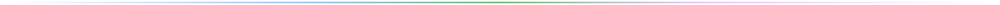
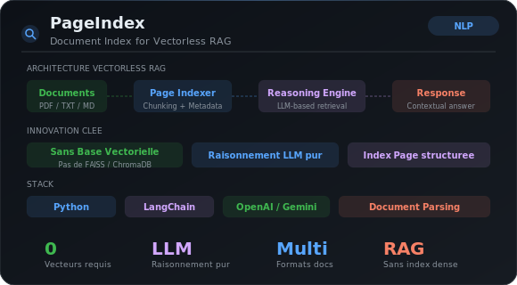
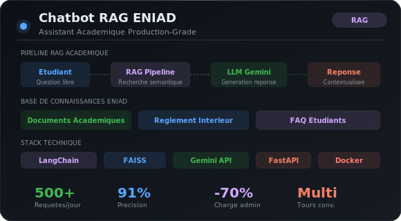
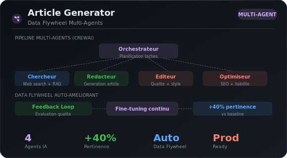
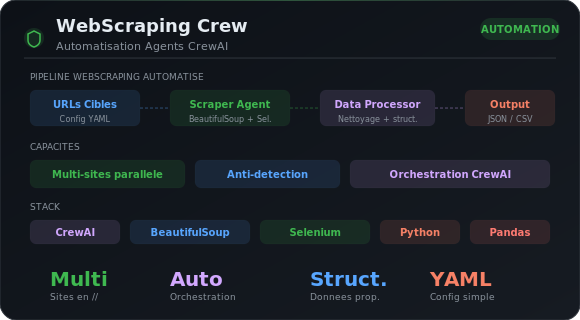
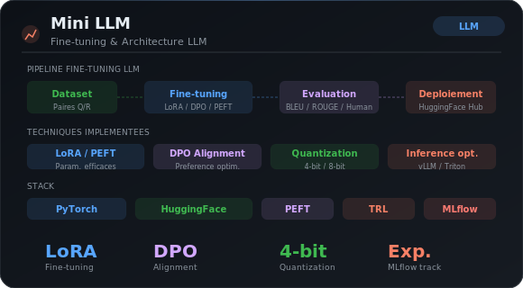
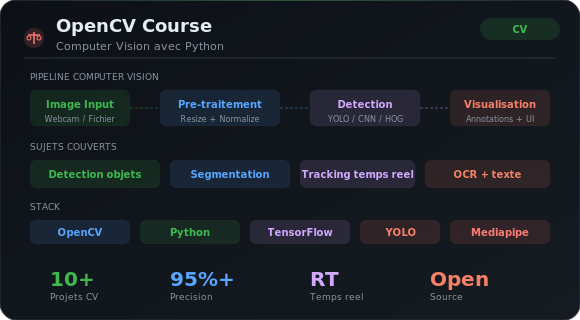

&nbsp;

&nbsp;

&nbsp;
&nbsp;
&nbsp;
&nbsp;

 

<!-- ═══════════════════════ ABOUT + STATS ═══════════════════════ -->

<table>
<tr>
<td width="55%" valign="top">

### À Propos

**AI & Deep Learning Engineer** basé à **Casablanca, Maroc**

Étudiant en **Ingénierie IA** à **ENIAD** (École Nationale d'Intelligence Artificielle et du Digital), diplôme 2026. Formation antérieure : **Licence Mathématiques & Informatique**.

Spécialisé dans la construction de systèmes IA production-ready : **Computer Vision**, **NLP**, **LLMs**, **MLOps**. Stages chez **Exakis Nelite**, **3D Smart Factory** et **HGS-Hightech**.

97% précision classification 3D · –60% temps traitement OCR · RAG en production

**Open to opportunities — PFE Internship Feb–Jul 2026**

 

### Stack Technique

**Langages** &nbsp;

**IA / ML** &nbsp;

**LLMs / RAG** &nbsp;

**Data** &nbsp;

**Backend** &nbsp;

**MLOps** &nbsp;

**Cloud** &nbsp;

</td>
<td width="45%" valign="top">

### Statistiques GitHub

 

 

</td>
</tr>
</table>

 

<!-- ═══════════════════════════════ METRICS ═══════════════════════════════ -->

### Résultats Mesurables

 

&nbsp;

&nbsp;

&nbsp;

 

<!-- ═══════════════════════════════ PROJECTS ═══════════════════════════════ -->

### Projets Phares

 

<!-- Row 1: PageIndex + Chatbot RAG ENIAD -->

&nbsp;

<!-- Row 2: Article Generator + WebScraping CrewAI -->

&nbsp;

<!-- Row 3: mini_llm + opencv-course -->

&nbsp;

 

<!-- ═══════════════════════════ OPEN SOURCE ═══════════════════════════ -->

### Contributions Open Source

 

  

<picture>
<source media="(prefers-color-scheme: dark)" srcset="./profile-3d-contrib/profile-night-green.svg" width="100%">

</picture>

 

<!-- ═══════════════════════════════ CONNECT ═══════════════════════════════ -->

### Let's Connect!

&nbsp;
&nbsp;
&nbsp;
&nbsp;

 

**Open For**

 

> *"Code • Train • Deploy • Repeat"*
>
> — Abdellah Ennajari

<!-- ═══════════════════════════════ FOOTER ═══════════════════════════════ -->

