  <!-- Animated Header Wave -->
  

<!-- Animated Typing Effect -->

  

<!-- Profile Views Counter + Animated Badges -->

  
  
  
  
  
  
  
  
  

---

## **About Me**

### **Professional Identity**

**Name:** Abdellah ENNAJARI  
**Role:** AI & Deep Learning Engineer  
**Location:** Casablanca, Morocco 🇲🇦

** Contact:**
- Email: abdellahennajari2018@gmail.com
- Phone: +212 667 156 625
- LinkedIn: [ennajari-abdellah](https://www.linkedin.com/in/ennajari-abdellah)
- GitHub: [ennajari](https://github.com/ennajari)

** Education:**
- **Current:** ENIAD - École Nationale d'IA & Digital (2023-2026)
- **Degree:** AI Engineering
- **Previous:** BSc Mathematics & Computer Science

### **Core Expertise**

**AI Frameworks:** TensorFlow, PyTorch, Transformers, HuggingFace  
**Computer Vision:** OpenCV, YOLO, CNN/LSTM, 3D Vision, OCR  
**NLP & LLMs:** LangChain, CrewAI, RAG, Fine-tuning, Agents  
**Generative AI:** Diffusion Models, LLMs, Multi-Modal AI  
**MLOps:** Docker, Git, Model Deployment, CI/CD, Weights & Biases  
**Data Science:** Pandas, NumPy, Spark, ETL/ELT, DVC  
**Programming Languages:** Python, C++, Java, SQL, NoSQL

### **Current Mission**

> Building production-ready AI systems that solve real-world problems  
> Researching cutting-edge Generative AI and LLM applications  
> Transforming innovative ideas into deployed solutions

### **What I Do Best**

<table>
  <tr>
    <td width="50%" valign="top">

#### **AI & Machine Learning**
- Deep Learning Architecture Design
- Model Training & Optimization
- Transfer Learning & Fine-tuning
- AutoML & Hyperparameter Tuning
- A/B Testing & Experimentation

    </td>
    <td width="50%" valign="top">

#### **Computer Vision**
- Image Classification & Detection
- Video Analysis & Tracking
- 3D Object Recognition (97% accuracy!)
- OCR & Document Processing
- Image Segmentation & Generation

    </td>
  </tr>
  <tr>
    <td width="50%" valign="top">

#### **NLP & LLMs**
- Large Language Model Fine-tuning
- RAG (Retrieval Augmented Generation)
- Multi-Agent Systems (CrewAI)
- Vector Databases & Embeddings
- Prompt Engineering & Optimization

    </td>
    <td width="50%" valign="top">

#### **MLOps & Production**
- Docker & Containerization
- Model Deployment & Serving
- CI/CD for ML Pipelines
- Model Monitoring & Logging
- Performance Optimization

    </td>
  </tr>
</table>

---

## **Certifications & Training**

| Certification | Issuer | Year | Link |
|:-----------------|:----------|:--------|:--------|
| **AI Infrastructure & Operations** | NVIDIA via Coursera | 2025 |  |
| **Natural Language Processing Specialization** | DeepLearning.AI | 2025 |  |
| **Professional Machine Learning Certificate** | 365 Data Science | 2024 |  |
| **Full-Stack Web Development** | YouCode Morocco | 2023 |  |

---

## **GitHub Statistics**

  <!-- GitHub Trophy -->
  

  <!-- GitHub Stats Cards -->
  
  

  <!-- GitHub Streak Stats -->
  

  <!-- Activity Graph -->
  

---

### **Contribution Snake Game**

  

  Watch the snake eat my contributions!

---

### **Development Time Breakdown**

```mermaid
%%{init: {'theme':'dark'}}%%
gantt
    title Weekly Development Focus
    dateFormat HH:mm
    axisFormat %H:%M

    section AI/ML
    Model Training       :00:00, 12h
    Data Processing      :00:00, 6h
    Research             :00:00, 4h

    section Development
    Coding              :00:00, 10h
    Code Review         :00:00, 3h
    Documentation       :00:00, 2h

    section Learning
    Reading Papers      :00:00, 4h
    Online Courses      :00:00, 3h

    section Collaboration
    Meetings            :00:00, 2h
    Team Sync           :00:00, 1h
```

---

## **Let's Connect!**

### **Professional Networks**

### **Contact Information**

---

### **Open For**

<table align="center">
  <tr>
    <td align="center" width="25%">
      
       <b>PFE Internship</b>
       Feb-July 2026
    </td>
    <td align="center" width="25%">
      
       <b>Collaborations</b>
       AI/ML Projects
    </td>
    <td align="center" width="25%">
      
       <b>Research</b>
       AI & Deep Learning
    </td>
    <td align="center" width="25%">
      
       <b>Consulting</b>
       ML/AI Solutions
    </td>
  </tr>
</table>

---

### **Let's Talk About**

  `AI` • `Deep Learning` • `Computer Vision` • `3D Vision` • `LLMs` • `Generative AI` • `RAG` • `MLOps` • `Research` • `Innovation`

---

  ### **Quote I Live By**

  

  ---

  ### **Fun Fact**

  

  
 Click to reveal!

   
  

    
      
    <b> I debug code faster than I debug my life!</b>
     
    When I'm not training neural networks, I'm probably training myself to drink more coffee ☕
  

  

  ---

  ###  **Profile Stats**

  Thanks for visiting! You are visitor number:
   
  

  ---

  <h3> "Code • Train • Deploy • Repeat" </h3>

   [ennajari](https://github.com/ennajari) 

  <!-- Animated Footer Wave -->
  

